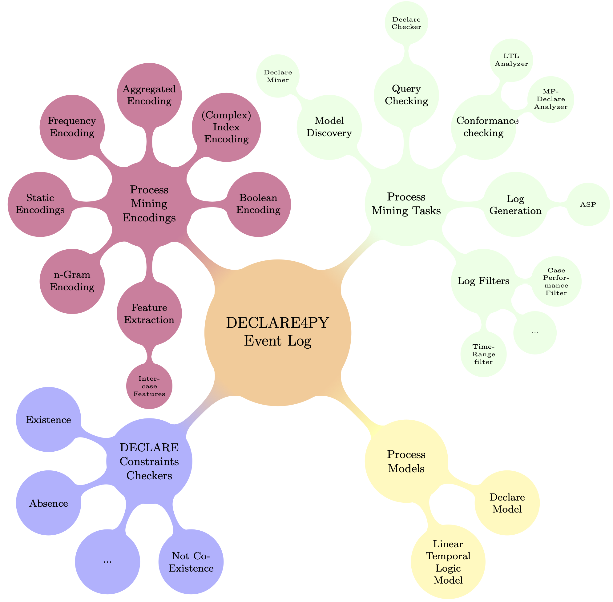

Getting Started
===================

An Overview of Declare4Py
-------------------

To better have an overview of Declare4Py let's focus on the mind map here below.

   
   The mind map of Declare4Py

There are five main concepts underlying Declare4Py:

1. **The event log** that stores traces of events with their attributes. This can be provided as input by users or synthetically generated.
2. **The declarative model** that formalizes the process model with declarative constraints expressed by Linear Temporal Logic or DECLARE formulas. This can be provided as input by users or discovered from an input event log.
3. **The engine of the declarative model** that computes the satisfaction of input DECLARE constraints in an event log in an efficient manner.
4. **The process mining tasks** that are implemented in Declare4Py by using different algorithms:

   a. The model discovery uses the algorithm in [1];
   b. ee
5. **The encodings for Machine Learning applications** transform an input event log into a matrix whose lines represent the single traces and the colums features associated to each trace. Such matrices are in a suitable format for the Machine Learning algorithms implemented in `scikit-learn <https://scikit-learn.org/stable/>`_.

[1] F. M. Maggi, R. P. J. C. Bose, W. M. P. van der Aalst, Efficient discovery of understandable declarative process models from event logs, in: CAiSE, 2012, pp. 270–285

Tutorials
-------------------

Here, you will find tutorials explaining how to utilize the different functionalities of Declare4Py.
All tutorials can be downloaded and run from our `Github. <https://github.com/ivanDonadello/Declare4Py/tree/v1.0.1/refactor-architecture/docs/source/tutorials>`_
List of available tutorials:

.. toctree::
   :maxdepth: 1
   :glob:
   
   tutorials/*
   tutorials/log_generator/*

